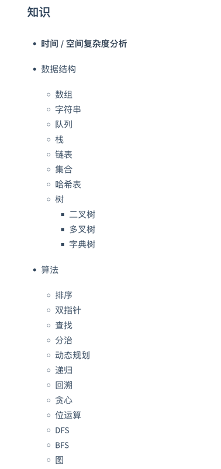

### Java-Base
- java 变量、结构控制、多线程、集合、泛型、反射、file、socket、mysql....
- 数据结构(dataStructure)
    - 数组
        - 稀疏数组
    - 队列
        - 数组模拟 
    - 链表
        - 单链表
        - 双向链表
        - 单向环形链表
    - 栈
      - 入门模拟(链表/数组)
      - 中缀表达式
      - 后缀表达式(逆波兰表达式)
    - 递归
      - 迷宫问题
      - 八皇后
    - 复杂度
      - 时间复杂度
        - 常数阶 O(1)
        - 对数阶 O(log2^n)
        - 线性阶 O(n)
        - 线性对数阶 O(nlog2^n)
        - 平方阶 O(n^2)
        - 立方阶 O(n^3)
        - k 次方阶 O(n^k)
        - 指数阶 O(2^n)
      - 空间复杂度
        - 本质就是空间换时间
    - 排序
      - 内存排序 
        - 插入排序
          - 直接插入排序 
          - 希尔排序 
        - 选择排序 
          - 简单选择排序 
            - 堆排序(大/小顶堆) 
        - 交换排序 
          - 冒泡排序 
          - 快速排序 
        - 归并排序 
        - 基数排序 
      - 外部排序
    - 查找
      - 无序 
        - 线性(顺序)查找
      - 有序(middle不一样)
        - 二分查找
        - 插值查找
        - 斐波那契
    - hashTable(散列-取膜)
    - 树
      - 基础
        - 二叉树
        - 顺序存储二叉树
        - 线索化二叉树
      - 应用
        - 堆排序(完全二叉树)
        - huffman tree(wpl)
        - huffman coding
        - 二叉排序树(delete)
        - 平衡二叉树(AVL树-旋转)
      - 多路查找树-多叉树(了解) 
        - 2-3树/2-4树..
        - B 树
        - B+树
        - B*树

    
### 数据结构算法路线
<code></code>

### 功能描述 
  - 1.IO流的分析 
    - 字节流
    - 字符流
    - 包装流
    - 节点流
    - 转换流  
  - 2.坦克大战（java awt+OOP+thread+file）  
  - 3.(多用户即时通讯系统) 实现了发送离线发送文件 私聊 新闻推送等 使用了socket(tcp)+thread+oop+file   
  - 4.mysql (基础查询(curd)->函数->索引->多表->事务.....)   
  - 5.满汉楼（文本）（mysql->druid+apache utils）-> manHanBuilding   
  - 6.regex 新增 regex 参考docx文档(2022-08-11) 
    - resource -> docx   
  - 7.java8(新特性) characteristic
    - lambda
    - function
    - 方法引用
    - stream
    - optional
    - 日期API(localDateTime..)  
  - 8.数据结构(dataStructure) 

[//]: # (  > 8.2022/08/23数据结构算法开始 )

  

### 笔记分享
- 1.语雀笔记地址 
> https://www.yuque.com/books/share/2401b162-4e19-4a11-9c26-c44507206b3a?# 《后端》
- 2.mysql 8.0中文文档地址
> https://docs.gitcode.net/mysql/guide/general-information/mysql-nutshell.html
- 3.jdbc驱动下载选择对应的(你本地mysql)版本 
> 选择 Platform Independent 
> > https://downloads.mysql.com/archives/c-j 

